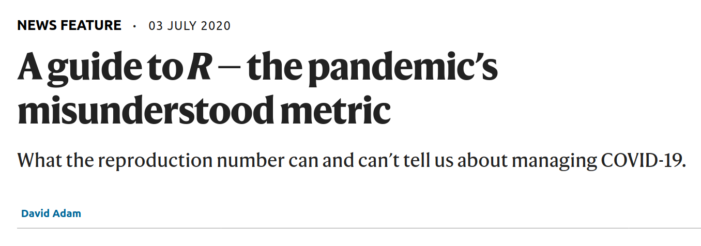

## Website Usage

**Map tab**: This tab shows a map of the Rt, case rate, or death rate by date
for various resolutions. Change the date by clicking on the displayed date and
using the calendar. Change the geographic resolution (country, states /
subnational, US states' counties) using the resolution dropdown menu, and click
on a location on the map to see a line graph of the Rt, case rate, and death
rate over time. In this plot, the dotted line shows the observed number of new
cases or deaths per day, while the solid line and gray band shows the calculated
Rt, case rate, or death rate along with a 95% confidence interval. You can
scroll to change the zoom of the map and click-drag to move the map around.
Locations where Rt, case rate, or death rate could not be calculated are shown
as gray in the map (see Limitations for more info).

By clicking "Show More", a heatmap and forest plot will be displayed. The
heatmap shows the values of the selected metric as colored blocks over time in
the selected geographic resolution. The forest plot shows the estimated value
(as a point) and 95% confidence interval (as a bar) of the selected metric on
the selected day. Locations where the metric could not be calculated are shown
as gray in the heatmap and not shown in the forest plot (see Limitations for
more info).

**Compare tab**: Select states / provinces / subnational units, US counties,
and countries to compare their Rt over time. You can select a location by using
the dropdown menu. You can also type the name of the location. Multiple
locations for each category (states, counties, and countries) can be chosen.
Additionally, choose which metrics to display and toggle display of the
confidence interval for the Rt, case rate, and death rate. After you click
submit, the results will be displayed as a series of line plots. Some areas may
not appear in the plot because of insufficient data (see Limitations for more
info).

**Table tab**: This tab shows a table of Rts for the chosen date and resolution,
as well as the number of new cases, new case rate, cumulative number of cases,
number of new deaths, new death rate, and cumulative number of deaths. The
columns displayed in the table can be changed by clicking the dialog box under
"Select Columns for Table". Click the "Reset Columns" button to reset the
columns to the default configuration, and click the "Download Table" button to
download the table as a csv file. This table is by default sorted in descending
order of case rate, but the sorting can be changed by clicking a column header.
Locations where Rt could not be calculated are not shown in the table (see
Limitations for more info).

### Downloading Plots / Maps / Rt

To download a plot, you can use the Download buttons, or alternatively
right-click on a plot and select "Save Image As..." Right now we do not have a
way to save a map, but in the meantime you can take a screenshot. To download
the information shown in the tables, please see the [Rt table CSV on our Github
page](https://github.com/lin-lab/COVID19-Viz/blob/master/clean_data_pois/) or
use the Table tab.

If you'd like the shapefiles with metrics information merged that we used for
our maps, they are saved as an RDS file on our
[Github](https://github.com/lin-lab/COVID19-Viz/blob/master/clean_data_pois/sf_all.rds).

## Method Description

We calculate and report the daily effective reproduction number (Rt), case rate,
and death rate to characterize the COVID-19 spread rate. The Rt is defined as
the expected number of secondary infectious cases produced by a primary
infectious case. Rt is used to determine the potential for epidemic spread at a
specific time t under the control measures in place (Figure 1, [Inglesby, T.V.,
2020](https://doi.org/10.1001/jama.2020.7878), reproduced below). If Rt \> 1,
the virus will spread out and the disease will become an epidemic; if Rt = 1,
the virus will spread locally and the disease is endemic; if Rt \< 1, the virus
will stop spreading and the disease will disappear eventually.

Figure credit: Thomas V. Inglesby, MD ([Inglesby, T.V.,
2020](https://doi.org/10.1001/jama.2020.7878))

We developed a method based on Poisson log-linear models to estimate the Rt,
case rate, and death rate. Briefly, we can model the expected number of new
cases per day as Rt times the infectivity potential, which is a weighted sum of
cases in the previous days. We can use a Poisson or negative binomial
generalized linear model (GLM) to model Rt as a function of covariates.
Specifically, we model Rt as a B-spline of time to smooth out weekly trends in
reporting. Using the estimated coefficients and standard errors from the GLM, we
can obtain estimates and confidence intervals for Rt. This method can be
extended to calculate the case rate and death rate by modeling the expected
number of new cases or deaths per day as the case or death rate times the
population. Additionally, we use the last available Rt estimates to create a
projection of the weekly case rates.

Our method requires the following data:

-   Daily new cases and deaths: we used data from Johns Hopkins
    University Center for Systems Science and Engineering (JHU-CSSE)
    [Coronavirus Resource
    Center](https://github.com/CSSEGISandData/COVID-19) ([Dong, E., et
    al, 2020](https://doi.org/10.1016/S1473-3099%2820%2930120-1)).

-   The input parameter values of the distribution of the disease serial
    interval: We used a Gamma distribution with a mean of 5.2 days and a
    standard deviation of 5.1 days ([He, X., et al,
    2020](https://doi.org/10.1038/s41591-020-0869-5)).

For a full description of our method, please see [our
paper](https://www.medrxiv.org/content/10.1101/2021.03.12.21253496v1):

### Rt Lag Adjustment

Because the number of reported cases on a particular day does not
represent the number of people who contracted COVID-19 on that day, the
Rt curve needs to be adjusted to account for the fact that people
contract COVID-19 before their case gets counted. As a heuristic, we
assume that there is a 7-day lag from the time a person contracts
COVID-19 until they are reported as a case, so we shift the Rt curve
back 7 days to reflect this. This assumes an average incubation period
of 7 days, which includes an average latent period of 3 days and an average
presymptomatic period 2 days (He, X., et al, 2020), plus an additional delay of
two days to account for the time between getting tested and receiving a test
result. Subjects are infectious during the presymptomatic period and are likely
to test positive. This assumption also considers that with the increasing
testing capacity, more presymptomatic and asymptomatic subjects are being
tested. The length of delay is likely to vary between individuals, regions, and
over time. See the Limitation section for further discussion.

### Limitations

Rt, case rate, and death rate estimation becomes unstable when there are only a
few new cases per day, when there is a large spike in cases in a single day or
when the total number of cases is small. We calculate Rt at the county level for
the US, and counties can have populations from the thousands to the millions.
Because of low population size or lack of testing or reporting, many counties in
the US as well as many countries with underdeveloped healthcare infrastructure
may not have many cases. Therefore, we do not show the Rt value on dates when
the number of total cases is below 50 or when the average number of new cases
within the previous 7 days is below 10; we do not show the case rate or death
rate values when the number of total cases or deaths is below 50 or when the
average number of new cases or deaths in the previous 7 days is below 1. We also
provide these metrics at different resolutions so we can aggregate data from
areas with few cases or deaths.

Our calculation of these metrics is dependent on the number of reported daily
new cases. We use the number of reported cases as a proxy for the number of
actual cases. In some instances, the number of reported cases is likely to be
lower than the number of actual cases because of reporting issues or lack of
COVID-19 testing. In other instances, local authorities may report cases from
several days on the same day; for example, they may not report many cases on
weekends but report many on Mondays. The reported cases in some regions include
cases using both PCR and antibody tests, where PCR tests detect incidence cases
(currently infected cases) and antibody tests detect prevalence cases
(previously infected cases). Including both may result in double counting. These
data issues can cause bias in point estimates and confidence interval estimates.
Therefore, we need to be cautious about interpreting these metrics for any
particular region and time and take into account how reliable the case numbers
are.

The metric Rt is defined at the time of infection and estimated using daily
reported cases using our modification of EpiEstim model (Cori, et al, 2013).
This model makes several assumptions including serial interval parameters,
length of case reporting delay, and constant ascertainment rate over time. The
length of case reporting delay is likely to vary between subjects, regions and
over time. Rts, case rates, and death rates are estimated assuming the model is
correctly specified. If the model is misspecified, the estimates and the
confidence interval estimates may be biased. One can perform a tailored analysis
by modifying model assumptions so they can be more suitable for a given region
and a given time interval. For example, if a region has a longer length of
reporting delay, the lag adjustment of Rt should be increased. Sensitivity
analysis is valuable to examine the robustness of model assumptions. Future
research is needed to develop advanced methods to address these limitations.

Finally, the projections of the weekly case rates are dependent on the Rt and
the model for case rates. If the Rt changes over time or if the data does not
follow the data generating process, the projections will be off.

## Interpretation, Using Metrics to Guide Reopening, and the Need for Multiple Metrics

Rt should not be used in isolation, and should be used as one of several
metrics, such as case rate and death rate, to measure the extent of the
epidemic in a region and consider when making reopening decisions.
Specifically, Rt measures the transmission rate, i.e, how rapid the
spread is on a given day. It is thus a relative measure on the
multiplicative scale. Absolute measures such as the number of new cases
per day or daily case rate should also be considered. For example, we
can consider Montana and Texas on 6/28 and New York on 5/18. We assume
Rt is lagged from the daily case data by 7 days, thus we will use the number of
cases until 7/5 and 5/18, respectively in calculations.

- Montana: Rt of 1.3, 95% CI (1.05 - 1.60), 45 new cases on 7/5.

- Texas: Rt of 1.16, 95% CI (1.02 - 1.31), 4265 new cases on 7/5.

- New York: Rt of 0.79, 95% CI (0.73 - 0.85), 1498 new cases on 5/18.

Montana has the highest Rt but doesn't have that many new cases. That's because
in the previous week it had around 30 cases, so having 45 new cases represents a
large jump, relative to 30 cases.

Texas has Rt above 1, which means the disease is spreading. It has a
lower Rt compared to Montana but still has a substantial number of new
cases. This means that the pandemic is spreading less quickly in Texas
than in Montana. However, it would not be right to say that Texas is
doing "better" than Montana and rely solely on the Rt metric, as there
are a much larger number of newly infected people in Texas given its
much higher case count. The pandemic has infected more people in Texas
than in Montana.

For New York on 5/11, the Rt was below 1. This means that the number of daily
cases decreased; however, on that day New York had one of the highest number of
new cases out of all 50 states. This means the interventions being put into
place were reducing the spread of the disease, but the number of newly infected
subjects was still large given NY had a larger number of cases to start with.

In summary, one needs to look at both relative measures such as Rt and
absolute measures such as the number of new cases per day or daily case
rate. Rt can tell us where the trajectory of the disease is heading
while the number of new cases per day and daily case rate can tell us
the size of the infected population, the number of lives the disease has
infected, and the number of people who may need medical attention or
need to be isolated. The discussed limitations of Rt should be kept in
mind. In addition, other metrics such as number of deaths, the number of
hospitalizations, hospital capacity, and adherence to mask wearing,
social distancing, quarantine and isolation, should be considered as
well, to evaluate health care capacity and the extent of the
implementation of intervention measures.

It is not safe to fully reopen without restrictions when the number of
cases is still large even when Rt is below 1, because those large number
of cases could go on to infect others. When Rt is sufficiently below 1
and the number of new cases is sufficiently small for two weeks, to
prevent resurgence reopening still needs to proceed with control
measures in place, such as mask wearing, social distancing, and
test-trace-isolate ([Hao et al,
2020](https://doi.org/10.1101/2020.04.27.20078436); [Powell,
2020](https://news.harvard.edu/gazette/story/2020/06/pandemic-threatens-to-veer-out-of-control-in-u-s/)).
Carefully planned multi-phased reopening with close monitoring of new cases
would be desirable.

## In the News

- [Nature News Feature](https://www.nature.com/articles/d41586-020-02009-w): A
  Guide to R---the pandemic's misunderstood metric.

>The Harvard site produces numbers for US counties---which can range from
>thousands to millions of inhabitants---but one of its creators, Xihong Lin,
>says that hyperlocal data come with big uncertainties. The researchers don't
>calculate an Rt for a county unless there are ten cases, Lin says. And she
>stresses that policymakers should not use them in isolation, but only alongside
>other measures such as the total number of cases and whether it is increasing.
>"When making recommendations, it's definitely important to look at the whole
>picture and not just rely on Rt," she says. Used properly, the data could help
>public-health officials to identify hot spots of infection to prioritize
>resources such as testing, she says.

## Citation and Code Availability

- Website code: <https://github.com/lin-lab/COVID19-Viz>

- COVID-19 data cleaning code: <https://github.com/lin-lab/COVID-data-cleaning>.
  This code was used to prepare the data from the JHU CSSE and state government
  COVID-19 case counts for the Rt calculations.

- Rt Calculation code: <https://github.com/lin-lab/COVID19-Rt>. This is the code
  we used to calculate the Rt values.

+ Our code is licensed under GPL-3.

+ If you'd like to use our code, data, or plots, please cite [our paper](https://www.medrxiv.org/content/10.1101/2021.03.12.21253496v1):

Shi, A.\*, Gaynor, S. M.\*, Quick, C. & Lin, X. Multi-resolution
characterization of the COVID-19 pandemic: A unified framework and open-source
tool. *In submission*.

## Credits

This website and the associated Rt analysis was developed by [Xihong
Lin's Group](https://content.sph.harvard.edu/xlin/) in the [Department
of Biostatistics](https://www.hsph.harvard.edu/biostatistics/) at the
[Harvard Chan School of Public Health](https://www.hsph.harvard.edu/).

- Website development: Andy Shi

- Rt Calculation: Andy Shi, Sheila Gaynor, Corbin Quick

- Helpful discussions: Xihao Li, Hui Li, Zilin Li, Derek Shyr

- Principal Investigator: Xihong Lin

- Special thanks to Evan Sarmiento and the team at [Harvard Institute of
  Quantitative Social Science (IQSS)](https://www.iq.harvard.edu/) for help with
  hosting.

## Contact Us

- If you have a question or feedback about the website, please write to us at
  `linlab.covid19.analysis@gmail.com`.

- If you found a bug on the website, please [create an issue on
    Github](https://github.com/lin-lab/COVID19-Viz/issues).

- If you have a bug fix or new feature to add, please create a pull request on
  Github.

## References

1.  Inglesby, T.V., 2020. Public health measures and the reproduction
    number of SARS-CoV-2. *JAMA*, 323(21), pp.2186-2187. doi:
    [10.1001/jama.2020.7878](https://doi.org/10.1001/jama.2020.7878)

2.  Cori, A., Ferguson, N.M., Fraser, C. and Cauchemez, S., 2013. A new
    framework and software to estimate time-varying reproduction numbers
    during epidemics. *American Journal of Epidemiology*, 178(9),
    pp.1505-1512. doi: <https://doi.org/10.1093/aje/kwt133>

3.  Thompson, R.N., Stockwin, J.E., van Gaalen, R.D., Polonsky, J.A.,
    Kamvar, Z.N., Demarsh, P.A., Dahlqwist, E., Li, S., Miguel, E.,
    Jombart, T. and Lessler, J., 2019. Improved inference of
    time-varying reproduction numbers during infectious disease
    outbreaks. *Epidemics*, 29, p.100356. doi:
    [10.1016/j.epidem.2019.100356](https://doi.org/10.1016/j.epidem.2019.100356)

4.  Wallinga, J. and Teunis, P., 2004. Different epidemic curves for
    severe acute respiratory syndrome reveal similar impacts of control
    measures. *American Journal of Epidemiology*, 160(6), pp.509-516.
    doi: [10.1093/aje/kwh255](https://doi.org/10.1093/aje/kwh255)

5.  Zhang, J., Litvinova, M., Wang, W., Wang, Y., Deng, X., Chen, X.,
    Li, M., Zheng, W., Yi, L., Chen, X. and Wu, Q., 2020. Evolving
    epidemiology and transmission dynamics of coronavirus disease 2019
    outside Hubei province, China: a descriptive and modelling study.
    *The Lancet Infectious Diseases*. doi:
    [10.1016/S1473-3099(20)30230-9](https://doi.org/10.1016/S1473-3099%2820%2930230-9)

6.  Dong, E., Du, H. and Gardner, L., 2020. An interactive web-based
    dashboard to track COVID-19 in real time. *The Lancet Infectious
    Diseases*, 20(5), pp.533-534. doi:[10.1016/S1473-3099(20)30120-1](https://doi.org/10.1016/S1473-3099%2820%2930120-1)

7.  He, X., Lau, E.H., Wu, P., Deng, X., Wang, J., Hao, X., Lau, Y.C.,
    Wong, J.Y., Guan, Y., Tan, X. and Mo, X., 2020. Temporal dynamics in
    viral shedding and transmissibility of COVID-19. *Nature Medicine*, 26(5),
    pp.672-675. doi:[10.1038/s41591-020-0869-5](https://doi.org/10.1038/s41591-020-0869-5)

8.  Hao, X., Cheng, S., Wu, D., Wu, T., Lin, X. and Wang, C., 2020. Full-spectrum dynamics of the coronavirus disease outbreak in Wuhan, China: a modeling study of 32,583 laboratory-confirmed cases. *medRxiv*. doi:[https://doi.org/10.1101/2020.04.27.20078436](https://doi.org/10.1101/2020.04.27.20078436)

9.  Powell, A. (2020). [Pandemic threatens to veer out of control in U.S.,
    public health experts say.](https://news.harvard.edu/gazette/story/2020/06/pandemic-threatens-to-veer-out-of-control-in-u-s/). *Harvard Gazette*.
