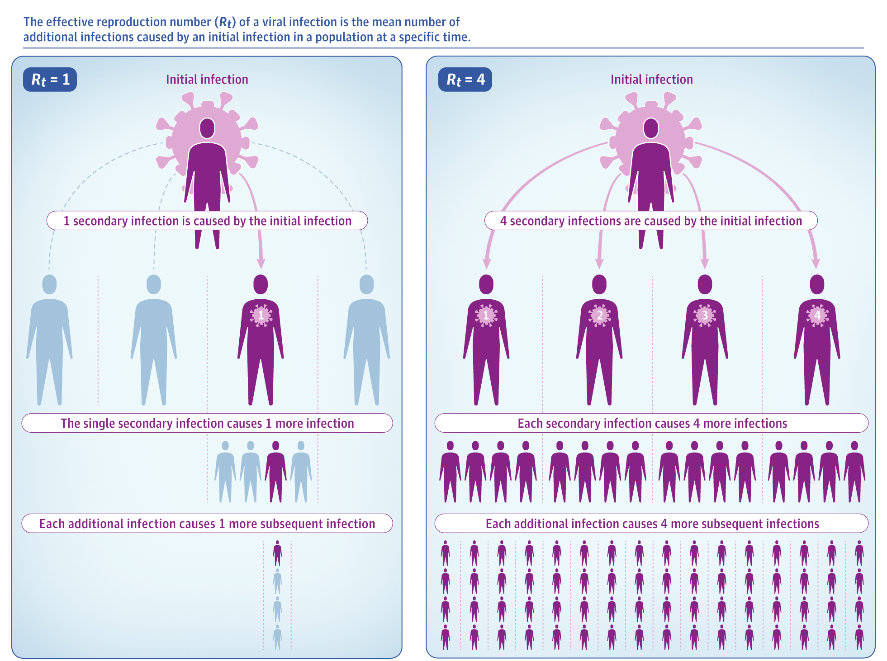

## Website Usage

**Rt map tab**: This tab shows a map of the Rt by date for various resolutions.
Change the date by adjusting the slider. Change the resolution (Country, US
states, US counties, Canadian/Chinese/Australian provinces) using the resolution
dropdown menu, and click on a location to see a line graph of the Rt over time
and of the number of daily new cases over time. You can scroll to change the
zoom of the map and click-drag to move the map around. Below the map, there is a
table of Rts for the chosen date and resolution. This table is by default sorted
in descending order of Rt, but the sorting can be changed by clicking a column
header. Locations where Rt could not be calculated are colored gray in the map
and not shown in the table (see Limitations section for more info).

Technical note: the blue line is a fitted loess curve to the Rt points, and the
error bars show the 95% posterior interval of Rt for that time point.

**Compare Rt tab**: Select states/provinces, US counties, and countries to
compare their Rt over time. You can select a location by using the dropdown
menu. You can also type the name of the location. Multiple locations for each
category (states/provinces, counties, and countries) can be chosen. After you
click submit, the results will be displayed as a line plot. Some areas may not
appear in the plot because of insufficient data (see Rt Method Description for
more info).

**Forest Plot tab**: This tab shows a forest plot of all the Rt values in a
given region on a given day. The estimated value of Rt is shown as a point, and
the error bars give a 95% credible interval. Change the resolution (Country, US
states, US counties, Canadian/Chinese/Australian provinces) using the resolution
dropdown menu. Locations where Rt could not be calculated are not shown (see
Limitations section for more info).

**Explore States tab**: This tab shows an overview for all the counties in a
selected state. The map on the top right shows the Rt for the counties in the
state for a selected date. Clicking a county will generate a plot of Rt and
number of daily new cases over time on the top left. The plot on the second row
on the left left shows the change in Rt over time for counties where Rt was able
to be calculated, and the plot on the right shows the same forest plot as in the
previous section except for the counties in the selected state. The date can be
adjusted using the slider, and an animation can be shown by clicking the blue
“play” button. You can zoom in and out by scrolling and you can move the map by
clicking and dragging. Below the plots, there is a table of Rt for the date
selected using the slider. This table is by default sorted in descending order
of Rt, but the sorting can be changed by clicking a column header.

### Downloading Plots / Maps / Rt

To download a plot, you can right-click on it and select "Save Image As..." Then
you'll be able to save the plot to your computer. Right now we do not have a way
to save a map, but in the meantime you can take a screenshot. To download the Rt
values, case / death counts, and other information shown in the tables, please
see the [Rt table CSV on our Github
page](https://github.com/lin-lab/COVID19-Viz/blob/master/clean_data/).

If you'd like the shapefiles with Rt information merged that we used for our
maps, they are saved as an RDS file on our [Github](https://github.com/lin-lab/COVID19-Viz/blob/master/clean_data/sf_all.rds).

## Rt Method Description

We calculate and report the daily effective reproduction number (Rt) to
characterize the virus spread, defined as the expected number of secondary
infectious cases produced by a primary infectious case. Rt is used to determine
the potential for epidemic spread at a specific time t under the control
measures in place (Figure 1, [Inglesby, T.V.,
2020](https://doi.org/10.1001/jama.2020.7878), reproduced below). If Rt >
1, the virus will spread out and the disease will become an epidemic; if Rt = 1,
the virus will spread locally and the disease is endemic; if Rt < 1, the virus
will stop spreading and the disease will disappear eventually.

Figure credit: Thomas V. Inglesby, MD ([Inglesby, T.V.,
2020](https://doi.org/10.1001/jama.2020.7878))

To obtain the Rt estimate, different methods could be considered
([Cori, A., et al., 2013](https://doi.org/10.1093/aje/kwt133);
[Thompson, R.N., et al., 2019](https://doi.org/10.1016/j.epidem.2019.100356);
[Walllinga, J. and Teunis, P., 2004](https://doi.org/10.1093/aje/kwh255);
[Zhang, J., et al., 2020](https://doi.org/10.1016/S1473-3099%2820%2930230-9)).
Here we focused on using the EpiEstim method (Cori, A., et al., 2013; Thompson,
R.N., et al., 2019) to estimate the daily Rt value. The EpiEstim method requires
the following inputs (and outputs the daily Rt estimates):

+ Daily positive increase cases: we used data from Johns Hopkins University
  Center for Systems Science and Engineering (JHU-CSSE) [Coronavirus Resource
  Center](https://github.com/CSSEGISandData/COVID-19) ([Dong, E., et al,
  2020](https://doi.org/10.1016/S1473-3099%2820%2930120-1)).

+ The time window of daily positive increase cases to be averaged (to smooth out
  the discreteness due to reporting). For our analysis, a 7-day window was used
  by default.

+ The input parameter values of the distribution of the disease serial interval:
  We used a Gamma distribution with a mean of 5.2 days and a standard deviation
  of 5.1 days ([He, X., et al, 2020](https://doi.org/10.1038/s41591-020-0869-5)).

We are also performing sensitivity analyses using different methods (Walllinga,
J. and Teunis, P., 2004; Zhang, J., et al., 2020) to evaluate the robustness of
Rt estimates obtained from EpiEstim and these methods.

We obtained Rt estimates for each day since March 19, 2020 for each country in
the JHU dataset. We also state/province level daily Rt estimates for the USA,
Australia, Canada, and China, as well as county-level daily Rt estimates for the
US.

### Rt Lag Adjustment

Because the number of reported cases on a particular day does not represent the
number of people who contracted COVID-19, the Rt curve needs to be adjusted to
account for the fact that people contract COVID-19 before their case gets
counted. As a heuristic, we assume that there is a 5-day lag from the time a
person contracts COVID-19 until they are reported as a case, so we shift the Rt
curve back 5 days to reflect this.

### Limitations

Rt estimation becomes unstable when there are only a few new cases per day or
when the total number of cases is small. We calculate Rt at the county level for
the US, and counties can have populations from the thousands to the millions.
Because of low population size or lack of reporting, many counties in the US as
well as many countries with underdeveloped healthcare infrastructure may not
have many cases. Therefore, we do not show the Rt value on dates when the number
of total cases is below 50 or when the average number of new cases within the
previous 7 days is below 10. We also provide Rt at different resolutions so we
can aggregate data from areas with few cases.

Furthermore, our calculation of Rt is dependent on the number of reported daily
new cases. We use the number of reported cases as a proxy measure for the number
of actual cases 5 days before the report date. In some instances, the number of
reported cases is likely to be lower than the number of actual cases because of
reporting issues or lack of COVID-19 testing. In other instances, local
authorities may report cases from several days on the same day; for example,
they may not report many cases on weekends but report many on Mondays.
Therefore, we need to be cautious about interpreting the Rt for any particular
region and time and take into account how reliable the case numbers are.

## Rt Interpretation and Using Rt to Guide Reopening

Rt should be used as one of several metrics, along with case rate and death
rate, to consider when making reopening decisions. Specifically, Rt measures the
transmission rate, i.e, how rapid the spread is on a given day. It is thus a
relative measure on the multiplicative scale. Absolute measures such as the
number of new cases per day or daily case rate should also be considered. For
example, we can consider Montana and Texas on 6/28 and New York on 5/11. Because
Rt is lagged from the daily case data by 5 days (see about tab for more info),
we will use the number of cases from 7/3 and 5/16, respectively.

+ Montana: Rt of 1.58, 95% CI (1.4 - 1.77), 67 new cases on 7/3.
+ Texas: Rt of 1.25, 95% CI (1.23 - 1.26), 6769 new cases on 7/3.
+ New York: Rt of 0.77, 95% CI (0.76 - 0.78), 2419 new cases on 5/16.

Montana has the highest Rt but doesn't have that many new cases. That's because
on previous days it had 40-50 cases, so having 67 new cases represents a big
jump, relative to 40-50.

Texas has Rt above 1, which means the disease is spreading. It has a lower Rt
compared to Montana but still has a substantial number of new cases. This means
that the pandemic is spreading less quickly in Texas than in Montana but it
would not be right to say that Texas is doing "better" than Montana, as there
are a much larger number of newly infected people in Texas given its much higher
case base. Hence the epidemic in Texas is much more severe than Montana.

For New York on 5/11, the Rt was low and below 1. This means that the number of
daily cases decreased. But on that day New York had the highest number of new
cases out of all 50 states. This means the interventions being put into place
were reducing the spread of the disease, but the number of newly infected
subjects was still large given NY had a larger base to start with.

In summary, one needs to look at both relative measures such as Rt and absolute
measures such as the number of new cases per day or daily case rate. Rt can tell
us where the trajectory of the disease is heading while the number of new cases
per day can tell us the size of the infected population, the number of lives the
disease has infected, and the number of people who may need medical attention or
need to be isolated. In addition, other metrics such as number of deaths, the
number of hospitalizations, hospital capacity, and adherence to mask wearing and
social distancing should be considered as well to evaluate health care capacity
and evaluate the extent of the implementation of intervention measures.

It is not safe to fully reopen with no restrictions when the number of cases is
still large even when Rt is below 1, because those large number of cases could
go on to infect others. When Rt is sufficiently below 1 and the number of new
cases is sufficiently small for two weeks, reopening still needs to proceed with
measures in place such as mask wearing, social distancing, and
test-trace-isolate. Reopening should be done in phases with close monitoring to
ensure there is not a spike in the number of cases.

## In the News

+ Our website was mentioned in a [Nature News
  Feature](https://www.nature.com/articles/d41586-020-02009-w). Key quote:

>The Harvard site produces numbers for US counties---which can range from
>thousands to millions of inhabitants---but one of its creators, Xihong Lin,
>says that hyperlocal data come with big uncertainties. The researchers don't
>calculate an Rt for a county unless there are ten cases, Lin says. And she
>stresses that policymakers should not use them in isolation, but only alongside
>other measures such as the total number of cases and whether it is increasing.
>“When making recommendations, it's definitely important to look at the whole
>picture and not just rely on Rt,” she says. Used properly, the data could help
>public-health officials to identify hot spots of infection to prioritize
>resources such as testing, she says.

## Code Availability

+ Website code: [https://github.com/lin-lab/COVID19-Viz](https://github.com/lin-lab/COVID19-Viz)
+ COVID-19 data cleaning code:
  [https://github.com/lin-lab/COVID-data-cleaning](https://github.com/lin-lab/COVID-data-cleaning).
  This code was used to prepare the data from the JHU CSSE and state government
  COVID-19 case counts for the Rt calculations.
+ Rt Calculation code:
  [https://github.com/lin-lab/COVID19-Rt](https://github.com/lin-lab/COVID19-Rt).
  This is the code we used to calculate the Rt values.

## Credits

This website and the associated Rt analysis was developed by [Xihong Lin's
Group](https://content.sph.harvard.edu/xlin/software.html) in the [Department of
Biostatistics](https://www.hsph.harvard.edu/biostatistics/) at the [Harvard Chan
School of Public Health](https://www.hsph.harvard.edu/).

+ Website development: Andy Shi
+ Rt Calculation: Sheila Gaynor
+ Sensitivity Analysis: Xihao Li, Hui Li, Zilin Li, Derek Shyr
+ Principal Investigator: Xihong Lin
+ Special thanks to Evan Sarmiento and the team at Harvard IQSS for help with
  hosting.

## Contact Us

+ If you have a question about the website, please write to us at
  `linlab.covid19.analysis@gmail.com`.

+ If you found a bug on the website, please [create an issue on
  Github](https://github.com/lin-lab/COVID19-Viz/issues).

+ If you have a bug fix or new feature to add, please create a pull request on
  Github.

## References

1. Inglesby, T.V., 2020. Public health measures and the reproduction
   number of SARS-CoV-2. *JAMA*, 323(21), pp.2186-2187. doi:
   [10.1001/jama.2020.7878](https://doi.org/10.1001/jama.2020.7878)

2. Cori, A., Ferguson, N.M., Fraser, C. and Cauchemez, S., 2013. A new
   framework and software to estimate time-varying reproduction numbers
   during epidemics. *American Journal of Epidemiology*, 178(9),
   pp.1505-1512. doi: [https://doi.org/10.1093/aje/kwt133](https://doi.org/10.1093/aje/kwt133)

3. Thompson, R.N., Stockwin, J.E., van Gaalen, R.D., Polonsky, J.A.,
   Kamvar, Z.N., Demarsh, P.A., Dahlqwist, E., Li, S., Miguel, E.,
   Jombart, T. and Lessler, J., 2019. Improved inference of time-varying
   reproduction numbers during infectious disease outbreaks.
   *Epidemics*, 29, p.100356. doi:
   [10.1016/j.epidem.2019.100356](https://doi.org/10.1016/j.epidem.2019.100356)

4. Wallinga, J. and Teunis, P., 2004. Different epidemic curves for
   severe acute respiratory syndrome reveal similar impacts of control
   measures. *American Journal of Epidemiology*, 160(6), pp.509-516.
   doi: [10.1093/aje/kwh255](https://doi.org/10.1093/aje/kwh255)

5. Zhang, J., Litvinova, M., Wang, W., Wang, Y., Deng, X., Chen, X., Li,
   M., Zheng, W., Yi, L., Chen, X. and Wu, Q., 2020. Evolving
   epidemiology and transmission dynamics of coronavirus disease 2019
   outside Hubei province, China: a descriptive and modelling study.
   *The Lancet Infectious Diseases*. doi:
   [10.1016/S1473-3099(20)30230-9](https://doi.org/10.1016/S1473-3099%2820%2930230-9)

6. Dong, E., Du, H. and Gardner, L., 2020. An interactive web-based
   dashboard to track COVID-19 in real time. *The Lancet Infectious
   Diseases*, 20(5), pp.533-534. doi:
   [10.1016/S1473-3099(20)30120-1](https://doi.org/10.1016/S1473-3099%2820%2930120-1)

7. He, X., Lau, E.H., Wu, P., Deng, X., Wang, J., Hao, X., Lau, Y.C.,
   Wong, J.Y., Guan, Y., Tan, X. and Mo, X., 2020. Temporal dynamics in
   viral shedding and transmissibility of COVID-19. *Nature Medicine*,
   26(5), pp.672-675. doi:
   [10.1038/s41591-020-0869-5](https://doi.org/10.1038/s41591-020-0869-5)
